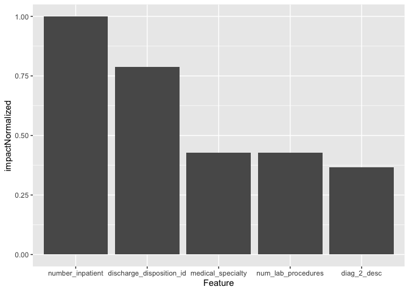
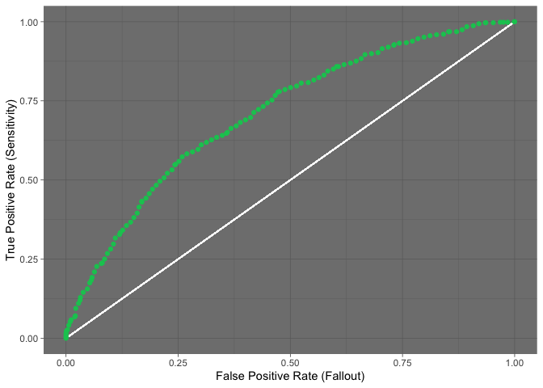

0\. R API Training - Introductory Notebook
================
Thodoris Petropoulos and Chester Ismay<br>Contributors: Rajiv Shah

Welcome to the `R API Training for DataRobot` course\! This notebook
provides you with the basics of how to connect to DataRobot, create a
project, and execute simple but useful commands. Pay close attention as
after you have finished reading this, there will be a series of
exercises that you will have to complete in order to get certified\! Of
course, we do not expect you to know the DataRobot package by heart. You
have three main documentation sources you can consult:

  - [API Documentation via CRAN
    Vignettes](https://CRAN.R-project.org/package=datarobot)
  - [Samples](https://github.com/datarobot-community/examples-for-data-scientists)
  - [Tutorials](https://github.com/datarobot-community/tutorials-for-data-scientists)

The last two links should provide you with the snippets you need to
complete most of these exercises.

Here is a high level overview of this notebook:

1.  Connecting to DataRobot <br>
2.  Creating a Project <br>
3.  Creating a Project with custom settings <br>
4.  Extracting Insights <br>
5.  Model Deployment<br>

<b>Data</b>

The dataset we will be using throughout these exercises is the
well-known `readmissions` dataset. You can access it or directly
download it through DataRobot’s public S3 bucket
[here](https://s3.amazonaws.com/datarobot_public_datasets/10k_diabetes.csv).

<b>Requirements</b>

  - R version 4.0.2
  - DataRobot API version 2.17.1

Small adjustments might be needed depending on the R version and
DataRobot API version you are using.

### Import Packages

``` r
library(dplyr)
```

    ## 
    ## Attaching package: 'dplyr'

    ## The following objects are masked from 'package:stats':
    ## 
    ##     filter, lag

    ## The following objects are masked from 'package:base':
    ## 
    ##     intersect, setdiff, setequal, union

``` r
library(ggplot2)
```

### 1\. Connecting to DataRobot

To use R with DataRobot you first need to establish a connection between
your machine and the DataRobot instance. The fastest and safest way to
do that is by creating a `.yaml` file with your credentials. This is
basically a text file containing two lines:

`endpoint: "YOUR_HOSTNAME"` <br> `token: "YOUR_API_TOKEN"`

You can then use the `ConnectToDataRobot()` function in the `datarobot`
package to connect to DataRobot like below. If you choose not to use a
yaml file, this is an example of the command you would use to connect to
DataRobot’s managed cloud service. (An on-premise customer would have a
different endpoint location).

`ConnectToDataRobot(endpoint = 'https://app.datarobot.com/api/v2', token
= 'YOUR_API_TOKEN')`

``` r
datarobot::ConnectToDataRobot(configPath = "config.yaml")
```

    ## Authentication token saved

``` r
library(datarobot)
```


### 2\. Creating a Project

For Classification, Regression and Multiclass Classification, the
process of starting a project (and modeling) is very straightforward.
All you have to do is use the `StartProject()` function.

Of course, there are many advanced options that we could have customised
but we are going to touch on that later in this script. For now, we are
going to use the default settings.

``` r
# I can link directly to my data (file, url) or I can also pass a dataframe to the dataSource variable
url_to_data <- "https://s3.amazonaws.com/datarobot_public_datasets/10k_diabetes.csv"

project <- StartProject(
  dataSource = url_to_data,
  projectName = "00_Introduction",
  target = "readmitted",
  workerCount = -1
)
```

    ## Project 00_Introduction creation requested, awaiting creation

    ## Project 5f35693cc541da0ff3236e61 (00_Introduction) created

    ## Autopilot started

    ## Project 5f35693cc541da0ff3236e61 updated

``` r
WaitForAutopilot(project = project)
```

    ## In progress: 13, queued: 0 (waited: 0s)

    ## In progress: 13, queued: 0 (waited: 2s)

    ## In progress: 13, queued: 0 (waited: 3s)

    ## In progress: 13, queued: 0 (waited: 5s)

    ## In progress: 13, queued: 0 (waited: 8s)

    ## In progress: 13, queued: 0 (waited: 10s)

    ## In progress: 13, queued: 0 (waited: 15s)

    ## In progress: 13, queued: 0 (waited: 22s)

    ## In progress: 13, queued: 0 (waited: 36s)

    ## In progress: 11, queued: 0 (waited: 57s)

    ## In progress: 7, queued: 0 (waited: 77s)

    ## In progress: 3, queued: 0 (waited: 99s)

    ## In progress: 2, queued: 0 (waited: 120s)

    ## In progress: 1, queued: 0 (waited: 140s)

    ## In progress: 1, queued: 0 (waited: 162s)

    ## In progress: 1, queued: 0 (waited: 182s)

    ## In progress: 1, queued: 0 (waited: 203s)

    ## In progress: 1, queued: 0 (waited: 224s)

    ## In progress: 1, queued: 0 (waited: 245s)

    ## In progress: 1, queued: 0 (waited: 265s)

    ## In progress: 7, queued: 0 (waited: 286s)

    ## In progress: 7, queued: 0 (waited: 307s)

    ## In progress: 7, queued: 0 (waited: 328s)

    ## In progress: 4, queued: 0 (waited: 349s)

    ## In progress: 0, queued: 0 (waited: 370s)

    ## In progress: 1, queued: 15 (waited: 391s)

    ## In progress: 12, queued: 4 (waited: 412s)

    ## In progress: 16, queued: 0 (waited: 433s)

    ## In progress: 3, queued: 0 (waited: 454s)

    ## In progress: 1, queued: 0 (waited: 475s)

    ## In progress: 0, queued: 0 (waited: 496s)

    ## In progress: 0, queued: 0 (waited: 517s)

    ## In progress: 0, queued: 0 (waited: 537s)

    ## In progress: 0, queued: 0 (waited: 558s)

    ## In progress: 0, queued: 0 (waited: 579s)

    ## In progress: 5, queued: 0 (waited: 600s)

    ## In progress: 3, queued: 0 (waited: 621s)

    ## In progress: 1, queued: 0 (waited: 642s)

    ## In progress: 1, queued: 0 (waited: 663s)

    ## In progress: 1, queued: 0 (waited: 684s)

    ## In progress: 0, queued: 0 (waited: 705s)

    ## In progress: 3, queued: 1 (waited: 726s)

    ## In progress: 3, queued: 1 (waited: 747s)

    ## In progress: 3, queued: 1 (waited: 768s)

    ## In progress: 1, queued: 0 (waited: 788s)

    ## In progress: 1, queued: 0 (waited: 810s)

    ## In progress: 1, queued: 0 (waited: 832s)

    ## In progress: 1, queued: 0 (waited: 852s)

    ## In progress: 1, queued: 0 (waited: 874s)

    ## In progress: 3, queued: 1 (waited: 895s)

    ## In progress: 3, queued: 1 (waited: 915s)

    ## In progress: 3, queued: 1 (waited: 936s)

    ## In progress: 1, queued: 1 (waited: 958s)

    ## In progress: 1, queued: 0 (waited: 979s)

    ## In progress: 1, queued: 0 (waited: 1000s)

    ## In progress: 1, queued: 0 (waited: 1021s)

    ## In progress: 1, queued: 0 (waited: 1041s)

    ## In progress: 1, queued: 0 (waited: 1062s)

    ## In progress: 1, queued: 0 (waited: 1084s)

    ## In progress: 1, queued: 0 (waited: 1105s)

    ## In progress: 1, queued: 0 (waited: 1126s)

    ## In progress: 1, queued: 0 (waited: 1147s)

    ## In progress: 1, queued: 0 (waited: 1167s)

    ## In progress: 1, queued: 0 (waited: 1188s)

    ## In progress: 0, queued: 0 (waited: 1209s)

    ## In progress: 0, queued: 0 (waited: 1230s)

    ## In progress: 0, queued: 0 (waited: 1251s)

    ## In progress: 0, queued: 0 (waited: 1271s)

    ## In progress: 0, queued: 0 (waited: 1292s)

    ## In progress: 0, queued: 0 (waited: 1313s)

The `WaitForAutopilot()` function will force our R Kernel to wait until
DataRobot has finished modeling before executing the next series of
commands.

The `workerCount` variable defines how many workers is the project going
to use when modeling. The value -1 means use all of the available
workers.

### 3\. Creating a Project with custom settings

We are now going to be using the same data to create a project with
custom settings.More specifically:

  - Start the project with `3-fold` cross validation
  - Start the project with `AUC` as the optimisation metric

To change the optimisation metric, we can just put a custom value in the
`metric` variable. When it comes to partitioning, we need to define a
partition object using the datarobot package. Some of the available
partitioning functions that will create the partition object are:

  - `CreateStratifiedPartition()`
  - `CreateRandomPartition()`
  - `CreateGroupPartition()`
  - `CreateUserPartition()`

<!-- end list -->

``` r
partitioning <- CreateStratifiedPartition(
  validationType = "CV",
  holdoutPct = 20,
  reps = 3
)

c_project <- StartProject(
  dataSource = url_to_data,
  projectName = "00_Introduction_with_custom_settings",
  target = "readmitted",
  metric = "AUC",
  workerCount = 1,
  partition = partitioning
)
```

    ## Project 00_Introduction_with_custom_settings creation requested, awaiting creation

    ## Project 5f356eb2c541da0fc8236f1c (00_Introduction_with_custom_settings) created

    ## Autopilot started

    ## Project 5f356eb2c541da0fc8236f1c updated

### 4\. Extracting Insights

There are multiple insights that we would want to extract from a
finished project in DataRobot:

1.  Trained models <br>
2.  Feature Impact<br>
3.  ROC Curve<br>

#### Get Trained Models

We can use the `ListModels()` function to retrieve a list of all the
trained DataRobot models for a specified `project`. We can then choose
the model we want from the list and get access to multiple methods for
results/specifics.

By default, the models will be ordered based on their validation score.
The first model will be the most accurate one.

``` r
ListModels(project)[1:3]
```

    ## [[1]]
    ## $blueprintId
    ## [1] "00be85b2883ed30553fa169d23cee847"
    ## 
    ## $featurelistId
    ## [1] "5f35695de9ff95bfdd533442"
    ## 
    ## $featurelistName
    ## [1] "Informative Features"
    ## 
    ## $isFrozen
    ## [1] FALSE
    ## 
    ## $isStarred
    ## [1] FALSE
    ## 
    ## $metrics
    ## $metrics$AUC
    ##   backtesting holdout backtestingScores crossValidation validation
    ## 1          NA      NA                NA         0.70761    0.70857
    ## 
    ## $metrics$`Rate@Top5%`
    ##   backtesting holdout backtestingScores crossValidation validation
    ## 1          NA      NA                NA          0.7725     0.7375
    ## 
    ## $metrics$`Max MCC`
    ##   backtesting holdout backtestingScores crossValidation validation
    ## 1          NA      NA                NA        0.310192    0.31783
    ## 
    ## $metrics$RMSE
    ##   backtesting holdout backtestingScores crossValidation validation
    ## 1          NA      NA                NA        0.457198    0.45798
    ## 
    ## $metrics$`Kolmogorov-Smirnov`
    ##   backtesting holdout backtestingScores crossValidation validation
    ## 1          NA      NA                NA        0.312504    0.31685
    ## 
    ## $metrics$`Rate@TopTenth%`
    ##   backtesting holdout backtestingScores crossValidation validation
    ## 1          NA      NA                NA               1          1
    ## 
    ## $metrics$LogLoss
    ##   backtesting holdout backtestingScores crossValidation validation
    ## 1          NA      NA                NA        0.605056    0.60609
    ## 
    ## $metrics$`FVE Binomial`
    ##   backtesting holdout backtestingScores crossValidation validation
    ## 1          NA      NA                NA         0.09904    0.09771
    ## 
    ## $metrics$`Gini Norm`
    ##   backtesting holdout backtestingScores crossValidation validation
    ## 1          NA      NA                NA         0.41522    0.41714
    ## 
    ## $metrics$`Rate@Top10%`
    ##   backtesting holdout backtestingScores crossValidation validation
    ## 1          NA      NA                NA         0.71625     0.6875
    ## 
    ## 
    ## $modelCategory
    ## [1] "blend"
    ## 
    ## $modelType
    ## [1] "AVG Blender"
    ## 
    ## $monotonicDecreasingFeaturelistId
    ## NULL
    ## 
    ## $monotonicIncreasingFeaturelistId
    ## NULL
    ## 
    ## $predictionThreshold
    ## [1] 0.5
    ## 
    ## $predictionThresholdReadOnly
    ## [1] FALSE
    ## 
    ## $processes
    ## [1] "Average Blender"
    ## 
    ## $projectId
    ## [1] "5f35693cc541da0ff3236e61"
    ## 
    ## $samplePct
    ## [1] 64
    ## 
    ## $supportsMonotonicConstraints
    ## [1] FALSE
    ## 
    ## $trainingRowCount
    ## [1] 6400
    ## 
    ## $projectName
    ## [1] "00_Introduction"
    ## 
    ## $projectTarget
    ## [1] "readmitted"
    ## 
    ## $projectMetric
    ## [1] "LogLoss"
    ## 
    ## $modelId
    ## [1] "5f356db6f93f5d0aff7970b1"
    ## 
    ## attr(,"class")
    ## [1] "dataRobotModel"
    ## 
    ## [[2]]
    ## $blueprintId
    ## [1] "a50c0fc9b3587f780ee89383979b928e"
    ## 
    ## $featurelistId
    ## [1] "5f35695de9ff95bfdd533442"
    ## 
    ## $featurelistName
    ## [1] "Informative Features"
    ## 
    ## $isFrozen
    ## [1] TRUE
    ## 
    ## $isStarred
    ## [1] FALSE
    ## 
    ## $metrics
    ## $metrics$AUC
    ##   backtesting holdout backtestingScores crossValidation validation
    ## 1          NA 0.70182                NA        0.707992    0.70977
    ## 
    ## $metrics$`Rate@Top5%`
    ##   backtesting holdout backtestingScores crossValidation validation
    ## 1          NA    0.69                NA          0.7525        0.7
    ## 
    ## $metrics$`Max MCC`
    ##   backtesting holdout backtestingScores crossValidation validation
    ## 1          NA 0.29377                NA        0.310966    0.32271
    ## 
    ## $metrics$RMSE
    ##   backtesting holdout backtestingScores crossValidation validation
    ## 1          NA 0.45945                NA        0.457608    0.45801
    ## 
    ## $metrics$`Kolmogorov-Smirnov`
    ##   backtesting holdout backtestingScores crossValidation validation
    ## 1          NA 0.29504                NA        0.315132     0.3298
    ## 
    ## $metrics$`Rate@TopTenth%`
    ##   backtesting holdout backtestingScores crossValidation validation
    ## 1          NA       1                NA               1          1
    ## 
    ## $metrics$LogLoss
    ##   backtesting holdout backtestingScores crossValidation validation
    ## 1          NA 0.60846                NA         0.60582     0.6061
    ## 
    ## $metrics$`FVE Binomial`
    ##   backtesting holdout backtestingScores crossValidation validation
    ## 1          NA 0.09397                NA        0.097896    0.09769
    ## 
    ## $metrics$`Gini Norm`
    ##   backtesting holdout backtestingScores crossValidation validation
    ## 1          NA 0.40364                NA        0.415984    0.41954
    ## 
    ## $metrics$`Rate@Top10%`
    ##   backtesting holdout backtestingScores crossValidation validation
    ## 1          NA   0.695                NA         0.71625      0.675
    ## 
    ## 
    ## $modelCategory
    ## [1] "model"
    ## 
    ## $modelType
    ## [1] "eXtreme Gradient Boosted Trees Classifier with Early Stopping"
    ## 
    ## $monotonicDecreasingFeaturelistId
    ## NULL
    ## 
    ## $monotonicIncreasingFeaturelistId
    ## NULL
    ## 
    ## $predictionThreshold
    ## [1] 0.5
    ## 
    ## $predictionThresholdReadOnly
    ## [1] FALSE
    ## 
    ## $processes
    ## [1] "Ordinal encoding of categorical variables"                    
    ## [2] "Converter for Text Mining"                                    
    ## [3] "Auto-Tuned Word N-Gram Text Modeler using token occurrences"  
    ## [4] "Missing Values Imputed"                                       
    ## [5] "eXtreme Gradient Boosted Trees Classifier with Early Stopping"
    ## 
    ## $projectId
    ## [1] "5f35693cc541da0ff3236e61"
    ## 
    ## $samplePct
    ## [1] 100
    ## 
    ## $supportsMonotonicConstraints
    ## [1] TRUE
    ## 
    ## $trainingRowCount
    ## [1] 10000
    ## 
    ## $projectName
    ## [1] "00_Introduction"
    ## 
    ## $projectTarget
    ## [1] "readmitted"
    ## 
    ## $projectMetric
    ## [1] "LogLoss"
    ## 
    ## $modelId
    ## [1] "5f356d033b6e1a4f72b68124"
    ## 
    ## attr(,"class")
    ## [1] "dataRobotModel"
    ## 
    ## [[3]]
    ## $blueprintId
    ## [1] "38599e10fe33b1631a69f4579d1accb4"
    ## 
    ## $featurelistId
    ## [1] "5f35695de9ff95bfdd533442"
    ## 
    ## $featurelistName
    ## [1] "Informative Features"
    ## 
    ## $isFrozen
    ## [1] FALSE
    ## 
    ## $isStarred
    ## [1] FALSE
    ## 
    ## $metrics
    ## $metrics$AUC
    ##   backtesting holdout backtestingScores crossValidation validation
    ## 1          NA      NA                NA        0.704744    0.70231
    ## 
    ## $metrics$`Rate@Top5%`
    ##   backtesting holdout backtestingScores crossValidation validation
    ## 1          NA      NA                NA          0.7675       0.75
    ## 
    ## $metrics$`Max MCC`
    ##   backtesting holdout backtestingScores crossValidation validation
    ## 1          NA      NA                NA        0.307614    0.30018
    ## 
    ## $metrics$RMSE
    ##   backtesting holdout backtestingScores crossValidation validation
    ## 1          NA      NA                NA        0.458072    0.45946
    ## 
    ## $metrics$`Kolmogorov-Smirnov`
    ##   backtesting holdout backtestingScores crossValidation validation
    ## 1          NA      NA                NA         0.31202    0.30447
    ## 
    ## $metrics$`Rate@TopTenth%`
    ##   backtesting holdout backtestingScores crossValidation validation
    ## 1          NA      NA                NA               1          1
    ## 
    ## $metrics$LogLoss
    ##   backtesting holdout backtestingScores crossValidation validation
    ## 1          NA      NA                NA        0.606702    0.60893
    ## 
    ## $metrics$`FVE Binomial`
    ##   backtesting holdout backtestingScores crossValidation validation
    ## 1          NA      NA                NA        0.096582    0.09348
    ## 
    ## $metrics$`Gini Norm`
    ##   backtesting holdout backtestingScores crossValidation validation
    ## 1          NA      NA                NA        0.409488    0.40462
    ## 
    ## $metrics$`Rate@Top10%`
    ##   backtesting holdout backtestingScores crossValidation validation
    ## 1          NA      NA                NA         0.72875        0.7
    ## 
    ## 
    ## $modelCategory
    ## [1] "model"
    ## 
    ## $modelType
    ## [1] "eXtreme Gradient Boosted Trees Classifier with Early Stopping"
    ## 
    ## $monotonicDecreasingFeaturelistId
    ## NULL
    ## 
    ## $monotonicIncreasingFeaturelistId
    ## NULL
    ## 
    ## $predictionThreshold
    ## [1] 0.5
    ## 
    ## $predictionThresholdReadOnly
    ## [1] FALSE
    ## 
    ## $processes
    ## [1] "Ordinal encoding of categorical variables"                    
    ## [2] "Converter for Text Mining"                                    
    ## [3] "Auto-Tuned Word N-Gram Text Modeler using token occurrences"  
    ## [4] "Missing Values Imputed"                                       
    ## [5] "eXtreme Gradient Boosted Trees Classifier with Early Stopping"
    ## 
    ## $projectId
    ## [1] "5f35693cc541da0ff3236e61"
    ## 
    ## $samplePct
    ## [1] 64
    ## 
    ## $supportsMonotonicConstraints
    ## [1] TRUE
    ## 
    ## $trainingRowCount
    ## [1] 6400
    ## 
    ## $projectName
    ## [1] "00_Introduction"
    ## 
    ## $projectTarget
    ## [1] "readmitted"
    ## 
    ## $projectMetric
    ## [1] "LogLoss"
    ## 
    ## $modelId
    ## [1] "5f356aa23b6e1a490db680ab"
    ## 
    ## attr(,"class")
    ## [1] "dataRobotModel"
    ## 
    ## attr(,"class")
    ## [1] "listOfModels" "listSubclass"

``` r
# Get most accurate model
most_accurate_model <- ListModels(project)[[1]]

# Get type of model
print(most_accurate_model$modelType)
```

    ## [1] "AVG Blender"

#### Get Feature Impact

Using the `GetFeatureImpact()` method, we will be retrieving feature
impact, save it into a dataframe, and then plot it.

``` r
# Get Feature Impact as a dataframe
fi_df <- GetFeatureImpact(most_accurate_model)

# Create plot of top 5 features based on Feature Impact
ggplot(
  data = fi_df %>% slice(1:5),
  mapping = aes(
    x = reorder(featureName, -impactNormalized),
    y = impactNormalized
  )
) +
  geom_col() +
  labs(x = "Feature")
```

<!-- -->

#### Get ROC Curve

ROC curve data can be generated for a specific data partition
(validation, cross validation, or holdout) or for all the data
partitions. Use the <code>get\_roc\_curve</code> method combined with
the partitioning of your choice. You can then plot the data like below.

``` r
roc <- GetRocCurve(
  model = most_accurate_model,
  source = "validation"
)
roc_df <- roc$rocPoints
head(roc_df)
```

    ##   fractionPredictedAsPositive falseNegativeScore falsePositiveRate
    ## 1                     0.00000                635       0.000000000
    ## 2                     0.00125                633       0.000000000
    ## 3                     0.00375                629       0.000000000
    ## 4                     0.00625                625       0.000000000
    ## 5                     0.01000                620       0.001036269
    ## 6                     0.01250                618       0.003108808
    ##   trueNegativeScore truePositiveScore matthewsCorrelationCoefficient
    ## 1               965                 0                     0.00000000
    ## 2               965                 2                     0.04361174
    ## 3               965                 6                     0.07563247
    ## 4               965                10                     0.09776384
    ## 5               964                15                     0.11105753
    ## 6               962                17                     0.10420149
    ##   liftNegative trueNegativeRate fractionPredictedAsNegative threshold
    ## 1     1.000000        1.0000000                     1.00000 1.0000000
    ## 2     1.001252        1.0000000                     0.99875 0.9218600
    ## 3     1.003764        1.0000000                     0.99625 0.8826312
    ## 4     1.006289        1.0000000                     0.99375 0.8387990
    ## 5     1.009054        0.9989637                     0.99000 0.8017493
    ## 6     1.009510        0.9968912                     0.98750 0.7886716
    ##   liftPositive positivePredictiveValue negativePredictiveValue
    ## 1     0.000000                  0.0000               0.6031250
    ## 2     2.519685                  1.0000               0.6038798
    ## 3     2.519685                  1.0000               0.6053952
    ## 4     2.519685                  1.0000               0.6069182
    ## 5     2.362205                  0.9375               0.6085859
    ## 6     2.141732                  0.8500               0.6088608
    ##   falsePositiveScore truePositiveRate     f1Score accuracy
    ## 1                  0      0.000000000 0.000000000 0.603125
    ## 2                  0      0.003149606 0.006279435 0.604375
    ## 3                  0      0.009448819 0.018720749 0.606875
    ## 4                  0      0.015748031 0.031007752 0.609375
    ## 5                  1      0.023622047 0.046082949 0.611875
    ## 6                  3      0.026771654 0.051908397 0.611875

``` r
dr_roc_green <- "#03c75f"
ggplot(
  data = roc_df,
  mapping = aes(
    x = falsePositiveRate,
    y = truePositiveRate
  )
) +
  geom_segment(
    mapping = aes(x = 0, xend = 1, y = 0, yend = 1),
    color = "white"
  ) +
  geom_point(color = dr_roc_green) +
  xlab("False Positive Rate (Fallout)") +
  ylab("True Positive Rate (Sensitivity)") +
  theme_dark()
```

<!-- -->

### Model Deployment

If you wish to deploy a model, all you have to do is use the
`CreateDeployment()` function. You also need to have the prediction
server that you want to host this deployment. Available prediction
servers can be retrieved using the `ListPredictionServers()` function.

``` r
prediction_server <- ListPredictionServers()[[1]]

deployment <- CreateDeployment(
  model = most_accurate_model,
  label = "New Deployment",
  description = "A new deployment",
  defaultPredictionServerId = prediction_server$id
)
deployment
```

    ## $model
    ## $projectId
    ## [1] "5f35693cc541da0ff3236e61"
    ## 
    ## $projectName
    ## [1] "00_Introduction"
    ## 
    ## $modelId
    ## [1] "5f356db6f93f5d0aff7970b1"
    ## 
    ## attr(,"class")
    ## [1] "dataRobotModel"
    ## 
    ## $defaultPredictionServer
    ## $url
    ## [1] "https://datarobot-predictions.orm.datarobot.com"
    ## 
    ## $id
    ## [1] "5b56f5308daae3002166d290"
    ## 
    ## $dataRobotKey
    ## [1] "cc0e0c01-8463-3e63-4794-5bea42900997"
    ## 
    ## attr(,"class")
    ## [1] "dataRobotPredictionServer"
    ## 
    ## $description
    ## [1] "A new deployment"
    ## 
    ## $modelHealth
    ## $modelHealth$status
    ## [1] "unknown"
    ## 
    ## $modelHealth$startDate
    ## NULL
    ## 
    ## $modelHealth$message
    ## [1] "Data drift tracking is disabled for this deployment."
    ## 
    ## $modelHealth$endDate
    ## NULL
    ## 
    ## 
    ## $predictionUsage
    ## $predictionUsage$dailyRates
    ## [1] 0 0 0 0 0 0 0
    ## 
    ## $predictionUsage$lastTimestamp
    ## NULL
    ## 
    ## 
    ## $capabilities
    ## $capabilities$supportsModelReplacement
    ## [1] TRUE
    ## 
    ## $capabilities$supportsTargetDriftTracking
    ## [1] TRUE
    ## 
    ## $capabilities$supportsFeatureDriftTracking
    ## [1] TRUE
    ## 
    ## 
    ## $label
    ## [1] "New Deployment"
    ## 
    ## $serviceHealth
    ## $serviceHealth$status
    ## [1] "unknown"
    ## 
    ## $serviceHealth$startDate
    ## NULL
    ## 
    ## $serviceHealth$endDate
    ## NULL
    ## 
    ## 
    ## $accuracyHealth
    ## $accuracyHealth$status
    ## [1] "unavailable"
    ## 
    ## $accuracyHealth$startDate
    ## NULL
    ## 
    ## $accuracyHealth$message
    ## [1] "Accuracy is unknown."
    ## 
    ## $accuracyHealth$endDate
    ## NULL
    ## 
    ## 
    ## $id
    ## [1] "5f356f74735d1f1986a970de"
    ## 
    ## $permissions
    ##  [1] "CAN_SHARE_DEPLOYMENT_OWNERSHIP"   "CAN_MAKE_PREDICTIONS"            
    ##  [3] "CAN_DELETE_CHALLENGERS"           "CAN_UPDATE_DEPLOYMENT_THRESHOLDS"
    ##  [5] "CAN_EDIT_CHALLENGERS"             "CAN_VIEW"                        
    ##  [7] "CAN_SHARE"                        "CAN_SCORE_CHALLENGERS"           
    ##  [9] "CAN_REPLACE_MODEL"                "CAN_ADD_CHALLENGERS"             
    ## [11] "CAN_EDIT_DEPLOYMENT"              "CAN_SUBMIT_ACTUALS"              
    ## [13] "CAN_APPROVE_REPLACEMENT_MODEL"    "CAN_DELETE_DEPLOYMENT"           
    ## 
    ## attr(,"class")
    ## [1] "dataRobotDeployment"
